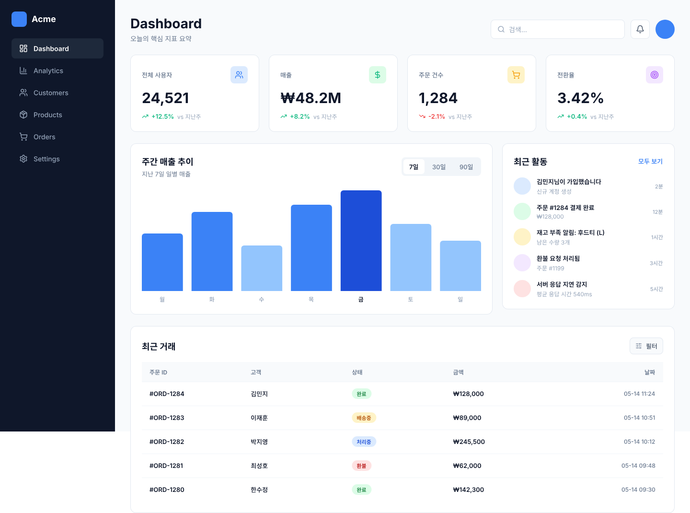
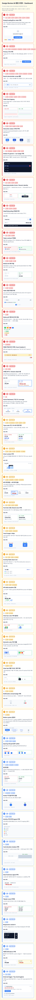

# claude-design-skills

Claude Code 디자인 리뷰 + 어노테이션 스킬 모음. **Pencil(.pen)** 파일과 **Figma** URL 모두 지원. 14개 스킬, 1 command 설치.

## 무엇을 하나

| 카테고리 | 스킬 수 | 용도 |
|---|---|---|
| 디자인 리뷰 (정적 분석) | 12 | 프레임을 rubric 기반으로 분석 → 한국어 마크다운 리뷰 보고서 생성 (UI 6 / UX 5 / CEO 1) |
| 멀티 레벨 wrapper | 1 | 11개 rubric 병렬 dispatch → L0 Surface·L1 Skeleton·L2 Structure·L5 Strategy 동시 집계 |
| 어노테이션 | 1 | 리뷰 .md (개별/집계) → 캔버스 옆 코멘트 패널 + After 시각 mockup 자동 부착 |

## 설치

```
/plugin marketplace add jaehoonkim-x/claude-design-skills
/plugin install claude-design-skills@claude-design-skills
```

14개 스킬 자동 등록 → 슬래시 명령으로 즉시 사용 가능.

## 사용 흐름

```
1. 리뷰 생성
   /design-ux-nielsen-review <figma-url-or-.pen>
   → .md 보고서 출력

2. 캔버스에 부착
   /annotate-design ./reviews/nielsen-output.md
   → Pencil/Figma 캔버스 옆에 코멘트 패널 + After 시각 mockup 부착

3. (선택) 멀티 레벨 일괄
   /design-review-all <design 파일>
   /annotate-design ./design-reviews/design-review-all-*.md
   → 11개 rubric 집계 finding 을 dedupe + SourceRail chip 으로 시각화
```

## 리뷰 스킬 (12)

### L0 Surface — UI 6종

| Skill | Rubric | 출처 |
|---|---|---|
| `design-ui-lawsofux-review` | 7 시각·게슈탈트 UI 법칙 | [lawsofux.com](https://lawsofux.com) |
| `design-ui-nielsen-review` | Aesthetic & Minimalist 시각 휴리스틱 | Jakob Nielsen |
| `design-ui-ixdf-review` | 5항목 (Desirable + Engagement + 3 Interaction Dim) | IxDF |
| `design-ui-ecommerce-review` | 3 카테고리 (Product Card / PDP / Homepage·PLP visual) | Baymard Institute |
| `design-ui-polish-review` | 10 시각 디자인 차원 (Hierarchy·Typography·Color·Spacing 등) | gstack `/ui-design-review` 기반 |
| `design-ui-critic-review` | 디자이너 비평 관점 (AI slop 판별 포함) | gstack `/design-review` 기반 |

### L1 Skeleton — UX 4종

| Skill | Rubric | 출처 |
|---|---|---|
| `design-ux-lawsofux-review` | 23 행동·인지 UX 법칙 | [lawsofux.com](https://lawsofux.com) |
| `design-ux-nielsen-review` | 9 UX 사용성 휴리스틱 | Jakob Nielsen |
| `design-ux-ixdf-review` | 12항목 (5 Factors + 4 Usability + 2 Interaction Dim) | IxDF |
| `design-ux-ecommerce-review` | 5 카테고리 (Form/Filter/Checkout/Cart/Trust) | Baymard Institute |

### L2 Structure — UX Flow 1종

| Skill | Rubric | 출처 |
|---|---|---|
| `design-ux-flow-review` | 6 Lens × 36 항목 (Flow / IA / Edge State / Dark Pattern / Conversion / Habit) | NN/g·Norman·Brignull·Hooked 등 |

### L5 Strategy — CEO 1종

| Skill | Rubric | 출처 |
|---|---|---|
| `design-ceo-review` | CEO/founder 10 전략 항목 (Premise·Leverage·Dream·KPI·Scope·자산 등) | gstack `/plan-ceo-review` 기반 |

## 멀티 레벨 wrapper (1)

### `design-review-all`

11개 rubric (UI 6 + UX 3 + UX Flow 1 + CEO 1) 을 단일 메시지에서 병렬 dispatch → L0 Surface + L1 Skeleton + L2 Structure + L5 Strategy 동시 진단. 개별 보고서 11개 + 집계 보고서 1개 (`design-review-all-{frame-slug}-{ts}.md`) 생성.

옵션:
- `--skip <skill1,skill2,...>` — 특정 rubric 제외
- `--only <skill1,...>` — 지정 rubric 만 실행
- `--goal "{task}"` / `--lens A,B,C` — `design-ux-flow-review` 인자 전달

```
/design-review-all ~/myapp.pen
/design-review-all https://figma.com/design/abc?node-id=42-1024 --skip design-ui-ecommerce-review
```

## 어노테이션 스킬 (1)

### `annotate-design`

#### 예시 (Pencil)

`design-review-all` 집계 .md → `annotate-design` 으로 부착한 결과. 좌측 Dashboard 프레임, 우측 통합 코멘트 패널 (37 카드, HIGH 15·MID 12·LOW 10, SourceRail chip + After 시각 mockup).

| 대상 프레임 | 캔버스 옆 통합 코멘트 패널 |
|---|---|
|  |  |

리뷰 .md → 디자인 캔버스 **옆** 에 시각화 (캔버스 위 핀·네이티브 코멘트 부착 안 함). 생성물 2종:

1. **코멘트 패널** — 캔버스 우측 finding 카드 컬럼 (severity 색·점수·근거·fix·참고 링크)
2. **After 시각 mockup** — 각 카드 안에 fix 적용 후 모습. **Iron Rule**: 텍스트 2줄 폴백 금지, 항상 시각 요소 1개 이상. 32 패턴 카탈로그 (Empty/Loading·CTA·Search scope·Status pill·Table 효율·Notification·WCAG·Token contract·도메인 KPI·Sparkline·Chart context·Sidebar IA·Touch target·Card elevation·Avatar·Tabular nums·Responsive·Brand swap·Fitts·Von Restorff·Cognitive Bias 등).

#### 입력 모드 자동 감지

| 모드 | 트리거 | 카드 |
|---|---|---|
| 개별 | `### 법칙명 — score: N` 패턴 .md | severity·점수·evidence·fix·link + After mockup |
| 집계 | `design-review-all-*.md` 또는 `## 통합 finding 목록` 헤더 | HIGH/MID/LOW · **SourceRail chip** (어떤 리뷰가 같은 finding 을 잡았는지 시각화) + After mockup |

session-key 기반 ID 추적 (`{type-prefix}-{HHmm}.c{N}`) — `crit-1310.c5`, `lawsofux-1430.c3`, `revall-1605.c12` 등 자기 설명적. 같은 캔버스에 여러 리뷰 누적해도 출처 즉시 파악.

## 요구 사항

| 출력 타겟 | MCP |
|---|---|
| `.pen` 파일 | Pencil MCP (`mcp__pencil__*`) |
| Figma URL | figma-console MCP (`mcp__figma-console__*`) — 쓰기 가능. claude.ai Figma MCP 는 읽기 전용 |

## 출력 언어

리뷰 마크다운·코멘트 패널 텍스트는 **한국어**. 법칙명·원어 표기는 영어 유지.

## 라이선스

MIT
